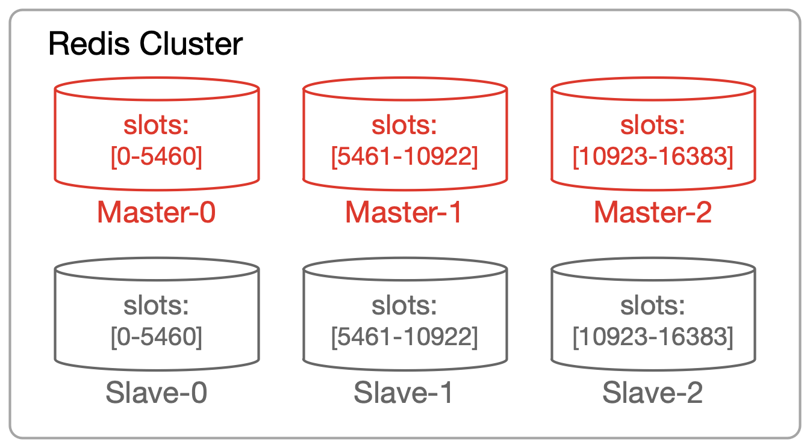
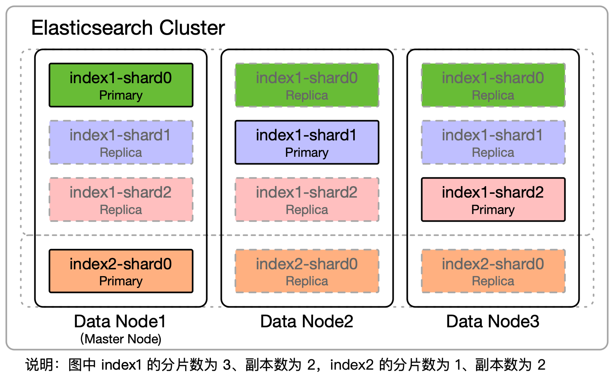
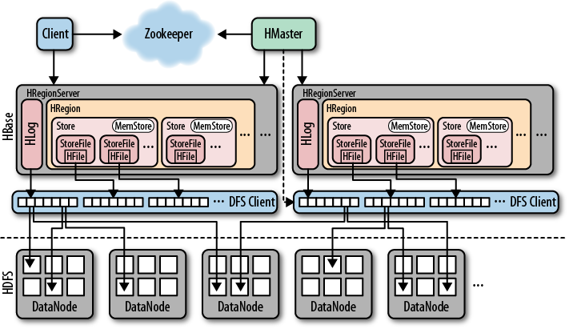



# MySQL（2001）

**MySQL 的数据分片和复制的历史演进时间线**：
+ [2001.01](https://web.archive.org/web/20010126203700/http://www.mysql.com/news/article-54.html)，MySQL 3.23 GA 版发布，开始提供复制（replication）功能，参见官方文档 [doc](https://dev.mysql.com/doc/refman/8.0/en/replication.html)。
+ [2007.06](https://www.infoq.com/news/2007/10/mysqlproxyrwsplitting/)，MySQL 官方发布 [MySQL Proxy](https://web.archive.org/web/20160413134318/http://dev.mysql.com/doc/mysql-proxy/en/mysql-proxy-introduction.html)，MySQL 代理服务器，支持内嵌 Lua 脚本，通过 Lua 脚本能实现负载均衡、主从自动故障切换、读写分离等。不过 MySQL Proxy 一直处于 Alpha 版状态，不推荐生产环境使用。2015 年发布 MySQL Router 后，MySQL Proxy 被废弃。
+ 2008.11，MySQL 5.1 GA 版发布，开始提供分区（partition）的功能，参见官方文档 [doc](https://dev.mysql.com/doc/refman/8.0/en/partitioning.html)。
+ 2014.05，[MySQL Fabric](https://web.archive.org/web/20150806192507/http://dev.mysql.com/doc/mysql-fabric/1.6/en/) GA 版发布，官方的高可用（HA）和数据分片（sharding）方案，基于客户端库（Fabric-aware Connector）实现分片路由，不支持跨分片查询。
  + 2017.07，MySQL Fabric 被官方废弃，推荐迁移到 MySQL InnoDB Cluster。
+ [2015.10](https://finance.yahoo.com/news/news/oracle-announces-general-availability-mysql-140000831.html)，MySQL 5.7 GA 版发布，代理服务器 [MySQL Router](https://dev.mysql.com/doc/mysql-router/8.0/en/) 也开始 GA 版可用，是 MySQL Proxy 的替代方案。同时，MySQL Group Replication 早期版可访问。
+ [2016.12](https://dev.mysql.com/blog-archive/mysql-group-replication-its-in-5-7-17-ga/)，MySQL 5.7.17 发布，MySQL 组复制（[Group Replication](https://dev.mysql.com/doc/refman/8.0/en/group-replication.html)）特性开始 GA 版可用。MySQL 组复制基于 Paxos 协议实现节点间的数据复制，实现主从自动故障切换，最多能容忍不超过半数的节点故障。
+ [2017.04](https://dev.mysql.com/blog-archive/mysql-innodb-cluster-ga/)，MySQL 官方的 [InnoDB Cluster](https://dev.mysql.com/doc/refman/8.0/en/mysql-innodb-cluster-introduction.html) 开始 GA 版可用，三个核心组件 Group Replication、MySQL Shell、MySQL Router。

**MySQL 官方版的数据分片和复制策略**[^1][^2]：
- **分片策略**：
  - **分片术语命名**：分区（[partition](https://dev.mysql.com/doc/refman/8.0/en/partitioning.html)）
    - 将单个表数据拆分为多个表分区中
  - **键-分片的分配关系**：同时支持按 Range 和 Hash 拆分，在定义表时手动指定分区规则
  - **分片-机器的分配关系**：拆分后的多个分区分布同一个服务器节点上
  - **分片再均衡**：无
- **复制策略**：主从（Master/Slave）模式，服务器节点区分主从（Master/Slave）两种角色，由一个 Master 节点和零到多个 Slave 节点组成复制组，Master 节点负责处理写和读请求，Slave 节点可用于读，复制组内的节点数据保持同步。虽然理论上从库允许直接修改，但修改可能会导致主从库数据不一致，不推荐对从库做写操作。
  - **复制单位**：以服务器节点（机器）为单位
  - **复制系数**：即复制组内的服务器节点数量
  - **副本更新传播策略**：支持异步复制（asynchronous replication）（默认）、半同步复制（[semisynchronous replication](https://dev.mysql.com/doc/refman/8.0/en/replication-semisync.html)）和组复制（[group replication](https://dev.mysql.com/doc/refman/8.0/en/group-replication.html)）三种模式
    - **组复制**（group replication），MySQL 5.7 开始支持，基于 **Paxos 协议**实现，是强一致性的复制，InnoDB Cluster 基于组复制实现。采用组复制的事务要求过半数以上节点同意后才提交，最多能容忍不超过半数的节点故障。
    - **全同步复制**（fully synchronous replication），指的是强一致性的全同步复制，[MySQL NDB Cluster](https://en.wikipedia.org/wiki/MySQL_Cluster) 采用基于 **2PC 协议**实现的全同步复制，MySQL NDB Cluster 基于 NDB 存储引擎，InnoDB 存储引擎不支持全同步复制。采用全同步复制的事务要求全部节点同意后才提交，对于共 n 个节点的集群，最多能容忍 n-1 个节点故障。
    - 全同步复制相对异步复制、半同步复制的性能最差，半同步复制介于异步复制和全同步复制之间。基于 Paxos 协议实现的组复制和基于 2PC 协议实现的全同步复制，都是强一致性，但组复制的性能优于全同步复制。
  - **副本读取策略**：Slave 节点可以用于处理读请求，需要依赖客户端或代理将写请求路由到 Master 节点，将读请求路由到 Slave 节点，从而实现**读写分离**，实现对读请求处理能力的水平扩展。
- **请求路由寻址**：可以将读请求路由到 Slave 节点，可以实现读写分离
  - 基于客户端的读写路由：MySQL Connector/J (JDBC) 3.1.7（2005.02 发布）开始支持读写分离，支持将读请求负载均衡到从库[^3]。
  - 基于代理的读写路由：MySQL Router 也支持读写分离（Read/Write Splitting）[^4]。
- **集群配置和协调**：
  - 分片策略在新建表时的 SQL 语句中指定；复制策略在配置文件中指定
  - **高可用方案**：实现主从自动故障切换
    - MGR（MySQL Group Replication）：MySQL 5.7 提供官方高可用方案，基于 Paxos 协议实现节点间的数据复制，最多能容忍不超过半数的节点故障。
    - [MHA](https://github.com/yoshinorim/mha4mysql-manager)（Master High Availability）：在 MySQL 官方推出在 MGR 之前，最流行的第三方高可用方案，[2011.07](https://yoshinorimatsunobu.blogspot.com/2011/07/announcing-mysql-mha-mysql-master-high.html) 最早对外发布，实现 Master 节点的自动故障切换。

MySQL InnoDB Cluster 架构，如下图所示[^5]：

MySQL 等传统关系数据库支持**表分区**（[partition](https://dev.mysql.com/doc/refman/8.0/en/partitioning.html)），但原生不支持**分片**（sharding），拆分后的表分区都分布在同一个服务器节点上。为了解决数据库的水平扩展问题，出现很多数据库分片方案。其中一类是基于传统关系数据库的“分库分表”中间件，如 [Vitess](https://github.com/vitessio/vitess)（基于代理服务器）、阿里 [TDDL](https://github.com/alibaba/tb_tddl)（基于客户端库）、阿里 [Cobar](https://github.com/alibaba/cobar)/DRDS（基于代理服务器）、[ShardingSphere](https://github.com/apache/shardingsphere)（包括基于客户端库的 ShardingSphere-JDBC 和基于代理服务器 ShardingSphere-Proxy）等。另外一类是非关系型的 [NoSQL](https://en.wikipedia.org/wiki/NoSQL) 数据库，如 BigTable、Dynamo、HBase、Cassandra 等。以及采用全新架构的 [NewSQL](https://en.wikipedia.org/wiki/NewSQL) 数据库，如 Google Spanner、CockroachDB、TiDB 等；或基于云服务的 NewSQL 数据库，如 Amazon Aurora、阿里 PolarDB 等。

# Redis（2009）

**Redis 的数据分片和复制的历史演进时间线**：
+ 2009.09，Redis 1.0 发布，开始支持主从节点数据复制，参见官方文档 [doc](https://redis.io/docs/management/replication/)
+ 2013.11，Redis 2.8 发布，开始提供 Redis Sentinel，用于监控各个 Redis 节点，实现主从节点自动故障切换，参见官方文档 [doc](https://redis.io/docs/management/sentinel/)
+ 2015.04，Redis 3.0 发布，开始提供 Redis Cluster，实现数据分片，参见官方文档 [doc](https://redis.io/docs/management/scaling/)

**Redis 的数据分片和复制策略**[^6][^7][^8][^9][^10]：
- **分片策略**：基于 Redis Cluster 实现数据分片
  - **分片术语命名**：哈希槽（hash slot）
    - 将全量数据拆分到多个哈希槽中。
  - **键-分片的分配关系**：按 Hash 拆分，基于哈希槽，哈希槽的总数固定为 `16384` (2^14)。
    - 某 key 分配的哈希槽的计算公式：`HASH_SLOT = CRC16(key) mod 16384`。
  - **分片-机器的分配关系**：手动配置哈希槽与服务器节点的分配关系
    - 相关命令：[cluster addslots](https://redis.io/commands/cluster-addslots/)（分配槽给某节点）、[cluster slots](https://redis.io/commands/cluster-slots/)（查看槽分配信息）等
    - 创建集群并自动分配槽的简化操作的命令工具：`redis-cli --cluster create --cluster-replicas `（Redis >= 5.0）或 `./redis-trib.rb create --replicas`（Redis < 5.0）
  - **分片再均衡策略**：手动 reshard
    - 相关命令：[cluster setslot](https://redis.io/commands/cluster-setslot/)（设置迁移槽状态）、[cluster getkeysinslot](https://redis.io/commands/cluster-getkeysinslot/)（获取属于某槽的 keys）、[migrate](https://redis.io/commands/migrate/)（迁移某 key 数据）等
    - 简化操作的命令工具：`redis-cli --cluster reshard`（Redis >= 5.0）或 `./redis-trib.rb reshard`（Redis < 5.0）
- **复制策略**：主从（Master/Slave）模式，服务器节点区分主从（Master/Slave）两种角色，由一个 Master 节点和零到多个 Slave 节点组成复制组，Master 节点负责处理写和读请求，Slave 库默认不可写，复制组内的节点数据保持同步。
  - **复制单位**：以服务器节点（机器）为单位
  - **复制系数**：即复制组内的服务器节点数量
  - **副本更新传播策略**：默认异步复制，通过 [wait](https://redis.io/commands/wait/)、[waitaof](https://redis.io/commands/waitaof/) 命令支持同步复制。
  - **副本读取策略**：Slave 节点可以用于处理读请求，需要依赖客户端将写请求路由到 Master 节点，将读请求路由到 Slave 节点，从而实现**读写分离**，实现对读请求处理能力的水平扩展。Redis 默认是异步复制，从副本节点中读到的数据可能是旧的，Redis 本身性能非常高，一般不建议开启读写分离。
    - **副本是否可读**：非 Redis Cluster 模式下，主库可写可读，从库默认不可写可读。因为历史原因从库可以配置为可写，但修改副本会导致主从库数据不一致，不推荐开启，参见文档 [doc](https://redis.io/docs/management/replication/#read-only-replica)。在 Redis Cluster 模式下，Slave 节点默认不接受任何读写请求，发送过来的键命令会重定向到负责槽的 Master 节点上。[readonly](https://redis.io/commands/readonly/) 命令允许将读请求重定向到 Slave 节点。 
    - **读写分离**：Lettuce 客户端库的 [ReadFrom](https://github.com/lettuce-io/lettuce-core/wiki/ReadFrom-Settings) 参数（默认 `MASTER`），Redisson 客户端库的 [readMode](https://github.com/redisson/redisson/wiki/2.-configuration) 参数（默认 `SLAVE`），支持将读请求路由到 Slave 节点。Jedis 客户端库暂时[不支持](https://github.com/redis/jedis/issues/3484) 读 Slave 节点，只支持读 Master 节点。
- **请求路由寻址**：
  - **基于客户端的分片路由**：在 Redis Cluster 模式下，需要客户端实现分片的路由寻址。Redis 接收任何键相关命令时首先计算键对应的槽，再根据槽找出所对应的节点，如果节点是自身，则处理键命令；否则回复 MOVED 重定向错误，通知客户端请求正确的节点。为了避免重定向错误，一般客户端（Jedis、Lettuce、Redisson 等）都会在本地缓存槽与节点的分配关系，即缓存路由信息，然后客户端基于缓存的路由信息直接将命令发送到键所属的节点。
- **集群配置和协调**：
  - Redis Cluster 采用**去中心化架构**，每个节点都维护全量元数据，节点间采用 Gossip 协议同步元数据，同步的元数据包括集群节点成员、槽分配信息、节点主从角色、节点存活状态等。
  - **自动选举主节点**
    - Redis Cluster 自身实现了高可用方案，如果 Master 节点出现故障，支持自动从 Slave 节点选举新的 Master 节点，实现主从节点自动故障切换。
    - 在非 Redis Cluster 模式下，Redis 的高可用方案是 Redis Sentinel，Sentinel 监控各个 Redis 节点，实现主从节点自动故障切换。

Redis Cluster 架构与分区和副本分布示例，如下图所示：

# Elasticsearch（2010）

**Elasticsearch 的数据分片和复制策略**[^11][^12]：
- **分片策略**：
  - **分片术语命名**：分片（shard）
    - 将单个索引数据拆分到多个分片中
  - **键-分片的分配关系**：按 Hash 拆分
    - 分片号的[计算公式](https://www.elastic.co/guide/en/elasticsearch/reference/8.11/mapping-routing-field.html)为（简化后）：`shard_num = hash(_routing) % num_primary_shards`。默认情况下，哈希函数采用 Murmur3 算法，`_routing` 值为文档 `_id`，`num_primary_shards` 值为 [number_of_shards](https://www.elastic.co/guide/en/elasticsearch/reference/8.11/index-modules.html#index-number-of-shards)， `number_of_shards` 配置项是在创建该索引时配置的分片总数，ES >= 7.0 默认值 `1`，ES < 7.0 默认值 `5`。
    - 相关源码：[IndexRouting](https://github.com/elastic/elasticsearch/blob/v8.11.0/server/src/main/java/org/elasticsearch/cluster/routing/IndexRouting.java)（[javadoc](https://javadoc.io/doc/org.elasticsearch/elasticsearch/8.11.0/org.elasticsearch.server/org/elasticsearch/cluster/routing/IndexRouting.html)）
  - **分片-机器的分配关系**：默认自动将分片均衡分配到各个节点。分配考虑的权重因素包括节点内的总分片数量、节点内的该索引的分片数量等。分片分配策略由分片分配器（ShardsAllocator）实现，分片分配器职责是分配未指定的分片、移动分片和重新均衡分片。触发分片分配的时机包括索引增删、节点增删、手工 reroute、副本数量改变、集群重启。
    - Elasticsearch 8.6.0 开始，默认分片分配器类型是 `desired_balance`，8.6.0 之前默认是 `balanced`，0.90.0 之前默认是 `even_shard`（在 Elasticsearch 2.0 被删除），由配置项 `cluster.routing.allocation.type` 控制。 
    - 相关源码：AllocationService#reroute（[javadoc](https://javadoc.io/doc/org.elasticsearch/elasticsearch/8.11.0/org.elasticsearch.server/org/elasticsearch/cluster/routing/allocation/AllocationService.html)）、[ShardsAllocator](https://github.com/elastic/elasticsearch/blob/v8.11.0/server/src/main/java/org/elasticsearch/cluster/routing/allocation/allocator/ShardsAllocator.java)（[javadoc](https://javadoc.io/doc/org.elasticsearch/elasticsearch/8.11.0/org.elasticsearch.server/org/elasticsearch/cluster/routing/allocation/allocator/ShardsAllocator.html)）、[BalancedShardsAllocator](https://github.com/elastic/elasticsearch/blob/v8.11.0/server/src/main/java/org/elasticsearch/cluster/routing/allocation/allocator/BalancedShardsAllocator.java)（[javadoc](https://javadoc.io/doc/org.elasticsearch/elasticsearch/8.11.0/org.elasticsearch.server/org/elasticsearch/cluster/routing/allocation/allocator/BalancedShardsAllocator.html)）、[DesiredBalanceShardsAllocator](https://github.com/elastic/elasticsearch/blob/v8.11.0/server/src/main/java/org/elasticsearch/cluster/routing/allocation/allocator/DesiredBalanceShardsAllocator.java)（[javadoc](https://javadoc.io/doc/org.elasticsearch/elasticsearch/8.11.0/org.elasticsearch.server/org/elasticsearch/cluster/routing/allocation/allocator/DesiredBalanceShardsAllocator.html)）、[EvenShardsCountAllocator](https://github.com/elastic/elasticsearch/blob/v1.7.0/src/main/java/org/elasticsearch/cluster/routing/allocation/allocator/EvenShardsCountAllocator.java)
  - **分片再均衡策略**：默认自动再均衡，由分片分配器（ShardsAllocator）实现
- **复制策略**[^13][^14]：主备（Primary/Backup）模式，或称为 Primary/Replica、Primary/Secondary、Master/Slave、Leader/Follower 等。分片副本分为主副两种角色，由一个 Primary 分片和零到多个 Replica 分片组成复制组，Primary 分片负责承担写请求，读请求由 Primary 分片和 Replica 分片共同承担，复制组内的分片数据保持同步。
  - **复制单位**：以分片为单位
  - **复制系数**：由配置项 [number_of_replicas](https://www.elastic.co/guide/en/elasticsearch/reference/8.11/index-modules.html#dynamic-index-number-of-replicas) 控制，即 Replica 分片的总数，默认值 `1`，即一个 Primary 分片和一个 Replica 分片
  - **副本更新传播策略**：复制策略类似于微软的 PacificA 复制协议，Kafka 的[分片复制](https://kafka.apache.org/36/documentation.html#replication)也类似于 PacificA 协议。
    - **Master 节点**维护**同步副本集合**（in-sync replica set）。协调节点将写操作请求转发到 Primary 分片上，在 Primary 分片上执行**写入前先检查**处于活动副本（active shard）数（活动副本近似等于同步副本[^15]），如果小于最小活动副本数（由配置项 `wait_for_active_shards` 控制，默认 `1`，只等待 Primary 分片），则等待直到数量满足或超时。检查通过后，在 Primary 分片上执行操作，执行成功后，转发该操作到当前同步副本集合的所有 Replica 分片。如果有多个 Replica 分片，则会并行转发。等所有的 Replica 分片执行操作并响应（可能成功，也可能失败）后，Primary 分片会把请求响应返回给协调节点，协调节点返回给客户端。如果 Replica 写入失败，会执行重试逻辑，但最终并不强求一定要在多少个节点写入成功。
      - 如果在 Primary 分片上执行写入操作失败，Primary 分片所在节点将发送消息到 Marter 节点。这个索引操作会等待（默认为最多一分钟）Master 节点提升一个 Replica 分片为新的 Primary 分片。然后这个操作会被转发给新的 Primary 分片。
      - 如果在 Replica 分片上执行写入操作失败，Primary 分片会向 Marter 节点发送一条消息，请求从同步副本集合中删除有问题的分片。只有在 Master 节点确认删除分片后，Primary 分片才会确认该操作。请注意，Master 节点还将指示另一个节点开始构建新的分片副本，以便将系统恢复到正常状态。
  - **副本读取策略**：Primary 分片和同步的 Replica 分片都可以承担读请求，若 Replica 分片被移出同步副本集合，将不再承担读请求。
- **请求路由寻址**[^16]：集群中任意节点隐式都是**协调节点**（Coordinating Node），并且节点的协调角色无法被禁用，每个节点都有能力处理任意请求，每个节点都知道集群中任一文档位置。客户端请求可以发送到集群的任何节点，收到请求的节点扮演协调节点角色，将请求转发给保存数据的数据节点。各个数据节点在本地执行请求，并将结果返回协调节点。协调节点收集数据，将每个数据节点的结果合并为单个全局结果，并将结果返回给客户端。
- **集群配置和协调**：由 **Master 节点** 负责
  - 由 **Master 节点**（Master Node）负责存储内容路由信息、配置信息等集群元数据，以及负责轻量级集群范围的操作，包括创建或删除索引、集群成员管理、分片分配等。如果集群元数据发生变更，Master 节点会把变更广播到集群的其他节点，让每个节点上的集群元数据保持同步。
  - **Master 节点自动选举**[^17][^18]：在集群启动或 Master 节点故障时，会从全部有 Master 资格的节点（Master-eligible Node）中自动选举中新的 Master 节点，选举基于过半（quorum）投票决策。Elasticsearch 7.0 之前节点选举默认基于内置的 Zen Discovery 模块，底层是变种的 Bully 算法，Elasticsearch 7.0（2019.04 发布）开始重新实现，类似于 Raft 算法。

# HBase（2007）

**HBase 的数据分片和复制的历史演进时间线**：
+ 2007.02，HBase 宣布在 Hadoop 项目中成立，成为 Hadoop 的子项目，参见 HADOOP-1045/[HBASE-287](https://issues.apache.org/jira/browse/HBASE-287)、first [commit](https://github.com/apache/hbase/tree/948d0cdec4fb35d70404b9b6e27743616400656d)。HBase 是 Google BigTable 的开源实现版，采用与 BigTable 类似的数据模型。表支持分片，单个表被拆分为多个 HRegion。
+ 2011.01，HBase 0.90 发布，开始支持集群间复制（inter-cluster replication），复制方式采用异步复制。
+ [2015.02](https://blogsarchive.apache.org/hbase/entry/start_of_a_new_era)，HBase 1.0 发布，开始实验性支持 Region 复制（region replication），也叫时间线一致的高可用读（timeline consistent high available reads），参见 [HBASE-10070](https://issues.apache.org/jira/browse/HBASE-10070)。该特性发布后，陆陆续续修复了一些 bug，比如 [HBASE-18223](https://issues.apache.org/jira/browse/HBASE-18223)，直到 HBase 1.4 才稳定下来。

**HBase 的数据分片和复制策略**[^19][^20]：
- **分片策略**：
  - **分片术语命名**：Region
  - **键-分片的分配关系**
    - **Range 拆分**：根据 Region 的文件大小阈值等负载因素自动触发 Region 拆分，配置项 `hbase.regionserver.region.split.policy`，Region 的拆分策略：
      - HBase 0.94 之前，默认是 [ConstantSizeRegionSplitPolicy](https://github.com/apache/hbase/blob/branch-2.5/hbase-server/src/main/java/org/apache/hadoop/hbase/regionserver/ConstantSizeRegionSplitPolicy.java)（[javadoc](https://hbase.apache.org/2.5/devapidocs/org/apache/hadoop/hbase/regionserver/ConstantSizeRegionSplitPolicy.html)），当一个 Region 最大文件大小超过设置阈值（`hbase.hregion.max.filesize`，默认 `1G`），触发 Region 分裂。
      - HBase 0.94 开始，默认 [IncreasingToUpperBoundRegionSplitPolicy](https://github.com/apache/hbase/blob/branch-2.5/hbase-server/src/main/java/org/apache/hadoop/hbase/regionserver/IncreasingToUpperBoundRegionSplitPolicy.java)（[javadoc](https://hbase.apache.org/2.5/devapidocs/org/apache/hadoop/hbase/regionserver/IncreasingToUpperBoundRegionSplitPolicy.html)）
      - HBase 2.0 开始，默认 [SteppingSplitPolicy](https://github.com/apache/hbase/blob/branch-2.5/hbase-server/src/main/java/org/apache/hadoop/hbase/regionserver/SteppingSplitPolicy.java)（[javadoc](https://hbase.apache.org/2.5/devapidocs/org/apache/hadoop/hbase/regionserver/SteppingSplitPolicy.html)）。如果 Region 个数等于 1，分裂阈值为 flush size * 2，否则阈值为最大文件大小。flush size 的配置项是 `hbase.hregion.memstore.flush.size`，默认 128MB。
    - **Region 合并**：使用 `merge_region` 命令可以人为触发执行 Region 合并。
  - **分片-机器的分配关系**[^21]：根据负载均衡策略自动分配放置
    - 配置项 `hbase.master.loadbalancer.class`，负载均衡策略
      - HBase 1.0 之前，默认 [SimpleLoadBalancer](https://github.com/apache/hbase/blob/branch-2.5/hbase-server/src/main/java/org/apache/hadoop/hbase/master/balancer/SimpleLoadBalancer.java)（[javadoc](https://hbase.apache.org/2.5/devapidocs/org/apache/hadoop/hbase/master/balancer/SimpleLoadBalancer.html)），策略是保证每个 RegionServer 的 Region 个数基本相等。
      - HBase 1.0 开始，默认 [StochasticLoadBalancer](https://github.com/apache/hbase/blob/branch-2.5/hbase-server/src/main/java/org/apache/hadoop/hbase/master/balancer/StochasticLoadBalancer.java)（[javadoc](https://hbase.apache.org/2.5/devapidocs/org/apache/hadoop/hbase/master/balancer/StochasticLoadBalancer.html)），不再单纯根据 Region 个数，而是由多种独立的影响负载因素加权计算的复合值。
      - 相关源码：[AssignmentManager](https://github.com/apache/hbase/blob/branch-2.5/hbase-server/src/main/java/org/apache/hadoop/hbase/master/assignment/AssignmentManager.java)（[javadoc](https://hbase.apache.org/2.5/devapidocs/org/apache/hadoop/hbase/master/assignment/AssignmentManager.html)）
  - **分片再均衡策略**：根据负载均衡策略自动 reshard
- **集群间的复制策略**[^22]：类似于 MySQL 的主从复制，HBase 复制，区分主集群（master cluster）和从集群（slave cluster）。主集群也称为源集群（source cluster）；从集群也称为目标集群（target cluster）或 peer 集群（peer cluster）。复制的主集群与从集群规模大小通常不一样，主集群会使用随机选择复制目标 HRegionServer 来平衡发送到每台 HRegionServer 的数据量。主集群内的每个 HRegionServer 都将自己的 HLog 日志（WAL 日志）的变更**推送**（push）到目标集群的其他 HRegionServer。
  - **复制单位**：以整个集群为服务单位
  - **复制系数**：与配置的从集群的数量直接相关
  - **副本更新传播策略**：采用异步复制（asynchronous replication），HBase 3.0 开始支持同步复制（[synchronous replication](https://hbase.apache.org/book.html#syncreplication)），参见 [HBASE-19064](https://issues.apache.org/jira/browse/HBASE-19064)。
- **分片的复制策略**[^23][^24][^25]：副本区分两种类型 Primary Region 副本和 Secondary Region 副本，同一 Region 的各个副本分布在不同的 HRegionServer 上，只有 Primary Region 副本可以接收客户端的写请求，Secondary Region 副本对客户端总是只读。默认不开启 Region 复制，在同个集群内只有单个 Region 副本，若开启，Region 副本将在集群内复制。
  - **复制单位**：以分片为单位
  - **复制系数**：在创建表时可以指定某表的复制系数，并且支持动态修改，默认复制系数为 1。
    - 如 `create 't1', {REGION_REPLICATION => 2}` 和 `alter 't1', {REGION_REPLICATION => 1}`
  - **副本更新传播策略**：采用异步复制，更新传播的具体实现机制有两种，storefile refresher 和 async wal replication。
    - 配置项 `hbase.regionserver.storefile.refresh.period`，默认值 0，若值非零，表示开启 storefile refresher。
    - 配置项 `hbase.region.replica.replication.enabled`，默认值 `false`，若值为 `true`，表示开启 async wal replication。
  - **副本读取策略**：读取一致性等级（consistency level）的分两种，`STRONG`（强）和 `TIMELINE`（时间线），默认强一致性。每次读取操作都可以设置不同的一致性等级。在强一致性等级下，只读取 Primary Region 副本。在时间线一致性等级下，先尝试读取 Primary Region 副本，在很短的间隔（默认为 10 毫秒），如果 Primary Region 副本没有响应，则还将发送 Secondary Region 副本的并行 RPC，从最先完成的 RPC 返回结果。结果可能从 Primary Region 副本中读到，也可能从 Secondary Region 副本中读到。Primary Region 副本总最新的，而 Secondary Region 副本可能过时。
      - 相关源码：[Consistency](https://hbase.apache.org/2.5/devapidocs/org/apache/hadoop/hbase/client/Consistency.html)
- **请求路由寻址**：
  - HBase 客户端会将 Region 路由信息缓存到本地，客户端可以直接根据本地缓存的 Region 路由信息将请求路由到正确的 HRegionServer 节点上。绝大部分的请求都属于这种情况。如果 Region 路由缓存为空，客户端先读取 ZooKeeper 上的 `hbase:meta` 表的 HRegionServer 访问地址，然后访问 HRegionServer 读取 Region 路由信息并缓存到本地。如 Region 路由缓存非空，但是根据缓存请求某 HRegionServer 后发现 Region 并不在该 HRegionServer 上，则说明缓存过期，需要读取最新的 `hbase:meta` 表数据，刷新缓存。
    - 相关源码：[MetaCache](https://github.com/apache/hbase/blob/branch-2.5/hbase-client/src/main/java/org/apache/hadoop/hbase/client/MetaCache.java)（[javadoc](https://hbase.apache.org/2.5/devapidocs/org/apache/hadoop/hbase/client/MetaCache.html)）
- **集群配置和协调**：
  - HMaster 主要负责 HBase 系统管理，包括 table 的操作管理、Region 的负载均衡和迁移等。
  - ZooKeeper 用于实现 HMaster 高可用、维护元数据、实现分布式表锁等。元数据，包括全部的 HMaster 的主备节点信息、全部的 HRegionServer 节点信息、全部的表信息、元数据表 `hbase:meta` 的 HRegionServer 访问地址等。`hbase:meta` 表用于保存全部 Region 信息。

HBase 架构，如下图所示[^20]：

# Cassandra（2008）

Cassandra，分布式设计基于 Amazon Dynamo，数据模型基于 Google BigTable。

**Cassandra 的数据分片和复制策略**：
- **分片策略**：
  - **分片术语命名**：虚拟节点（virtual node）
  - **键-分片的分配关系**：按 Hash 拆分。基于虚拟节点，一种改进版的一致性哈希算法
  - **分片-机器的分配关系**：手动配置每个物理节点包含的虚拟节点数（默认 256 个）
  - **分片副本-机器的分配关系**：轮询（round-robin）分配
    - `SimpleStrategy` 和 `NetworkTopologyStrategy` 
  - **分片再均衡策略**：自动 reshard
    - 基于虚拟节点的一致性哈希，在节点加入或删除时触发自动 reshard
- **复制策略**：
  - **复制单位**：以分片为单位
  - **复制系数**：
  - **副本更新传播策略**：
- **请求路由寻址**：
- **集群配置和协调**：
  - 采用**去中心化架构**，每个节点都维护全量元数据，节点间采用 Gossip 协议同步元数据

# TiDB（2017）

2017.10，TiDB 对外发布 1.0 GA，设计上受 Google 的 Spanner / F1 数据库启发。

**TiDB 的数据分片和复制策略**：
- **分片策略**：
  - **分片术语命名**：Region
  - **键-分片的分配关系**：按 Range 拆分
  - **分片-机器的分配关系**：根据负载自动分片（auto-sharding）
  - **分片再均衡策略**：自动 reshard
    - 根据分区的数据量大小阈值触发自动拆分或合并
- **复制策略**：
  - **复制单位**：以分片为单位
  - **复制系数**：
  - **副本更新传播策略**：基于 Raft 协议
  - **副本读取策略**：
- **请求路由寻址**：
- **集群配置和协调**：
  - 由 PD Server 分配分区和维护元数据（包括分区和节点的分配信息）

# 参考资料

数据密集型应用系统设计，Martin Kleppmann，2015，[豆瓣](https://book.douban.com/subject/30329536/)：第5章 数据复制，第6章 数据分区

[^1]: MySQL 8.0 Reference Manual: Chapter 24 Partitioning <https://dev.mysql.com/doc/refman/8.0/en/partitioning.html>
[^2]: MySQL 8.0 Reference Manual: Chapter 17 Replication <https://dev.mysql.com/doc/refman/8.0/en/replication.html>
[^3]: MySQL Connector/J Developer Guide: Chapter 9 Multi-Host Connections: 9.4 Configuring Source/Replica Replication with Connector/J <https://dev.mysql.com/doc/connector-j/en/connector-j-source-replica-replication-connection.html>
[^4]: MySQL Router: Chapter 3 Deploying MySQL Router: 3.5 Read/Write Splitting <https://dev.mysql.com/doc/mysql-router/8.3/en/router-read-write-splitting.html>
[^5]: MySQL 8.0 Reference Manual: Chapter 21 InnoDB Cluster <https://dev.mysql.com/doc/refman/8.0/en/mysql-innodb-cluster-introduction.html>

[^6]: Redis 3.2 开发与运维，付磊、张益军，2017，[豆瓣](https://book.douban.com/subject/26971561/)：第6章 复制，第9章 哨兵，第10章 集群
[^7]: Redis Documentation > Manage Redis > Redis replication <https://redis.io/docs/management/replication/>
[^8]: Redis Documentation > Manage Redis > Scale with Redis Cluster <https://redis.io/docs/management/scaling/>
[^9]: Redis Documentation > Reference > Redis cluster specification <https://redis.io/docs/reference/cluster-spec/>
[^10]: Redis Documentation > Manage Redis > High availability with Redis Sentinel <https://redis.io/docs/management/sentinel/>

[^11]: Elasticsearch 6.1 源码解析与优化实战，张超，2019，[豆瓣](https://book.douban.com/subject/30386800/)
[^12]: Elasticsearch 2.x 权威指南：分布式文档存储 <https://www.elastic.co/guide/cn/elasticsearch/guide/current/distributed-docs.html>
[^13]: Elasticsearch Guide > Reading and Writing documents <https://www.elastic.co/guide/en/elasticsearch/reference/8.12/docs-replication.html>
[^14]: 2018-04 阿里王怀远：Elasticsearch分布式一致性原理剖析(三)-Data篇 <https://zhuanlan.zhihu.com/p/35285514>
[^15]: 2020-06 Clarifying the difference between Active shards and in-sync copies <https://discuss.elastic.co/t/238716>
[^16]: Elasticsearch Guide > Node <https://www.elastic.co/guide/en/elasticsearch/reference/8.12/modules-node.html>
[^17]: Elasticsearch Guide > Quorum-based decision making <https://www.elastic.co/guide/en/elasticsearch/reference/8.12/modules-discovery-quorums.html>
[^18]: 2019-03 Elasticsearch 集群协调迎来新时代（7.0） <https://www.elastic.co/cn/blog/a-new-era-for-cluster-coordination-in-elasticsearch>

[^19]: HBase 2.x 原理与实践，胡争，2019，[豆瓣](https://book.douban.com/subject/34819650/)
[^20]: HBase 0.91 权威指南，Lars George，2011，[豆瓣](https://book.douban.com/subject/25784835/)
[^21]: Apache HBase Reference Guide: 72.2. Region-RegionServer Assignment <https://hbase.apache.org/book.html#regions.arch.assignment>
[^22]: Apache HBase Reference Guide: 165. Cluster Replication <https://hbase.apache.org/book.html#_cluster_replication>
[^23]: Apache HBase Reference Guide: 75. Timeline-consistent High Available Reads <https://hbase.apache.org/book.html#arch.timelineconsistent.reads>
[^24]: 2014-06 HBase Read High Availability Using Timeline-Consistent Region Replicas <https://www.slideshare.net/slideshow/features-session-1/35938207>
[^25]: 2018-06 阿里杨文龙：深入解读 HBase2.0 新功能之高可用读 Region Replica <https://developer.aliyun.com/article/599162>