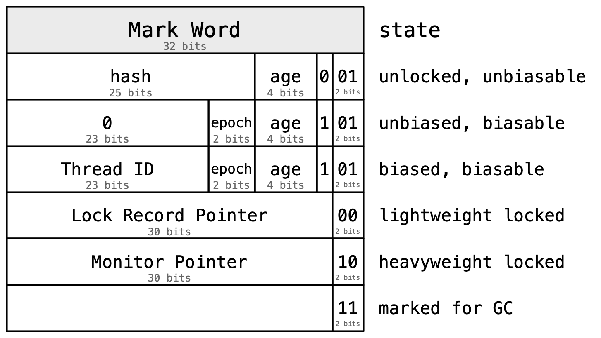
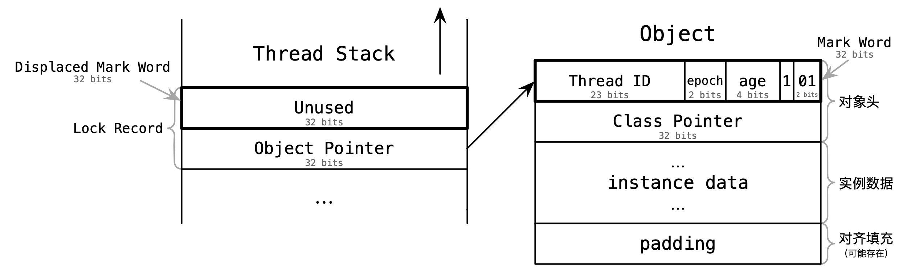
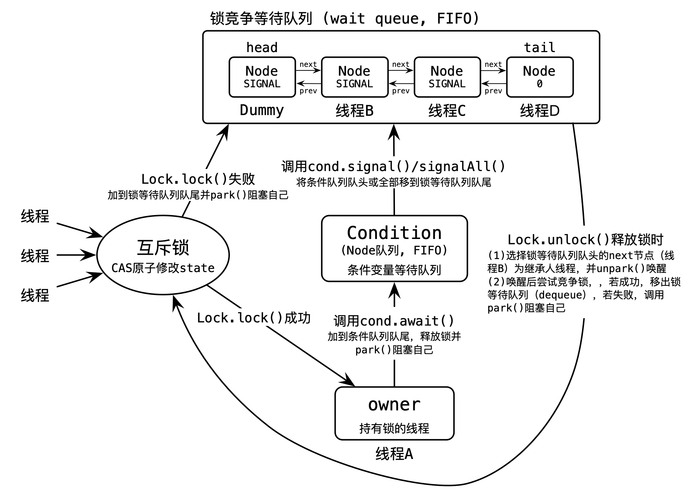

关于 Java 线程同步的实现原理，官方有很多介绍资料[^1][^2][^3][^4][^5][^6][^7]，值得阅读。

# 基础概念

在并发编程模型中，需要处理的两个最关键的问题就是**通信**（communication）和**同步**（synchronization）[^8]。通信指线程可用于获得其他线程产生的信息的各种机制。通信机制通常都基于**共享内存**（[shared memory](https://en.wikipedia.org/wiki/Shared_memory)）或**消息传递**（[message passing](https://en.wikipedia.org/wiki/Message_passing)）。在共享内存的编程模型中，某些或全部程序变量可以由多个线程访问。如果一对线程之间需要通信，只要一个线程将值写入某个变量，另一线程来读它即可。在消息传递编程模型中，不同线程没有公共的状态。当一对线程之间需要通信时，其中的一个必须执行一次明确的 send 操作，将数据传送给另一个线程。

同步[^8]是控制不同线程之间操作发生的相对顺序的各种机制，用以排除导致不正确结果的交错。消息传递模型中的同步通常是隐式的，消息的发送必须在接收之前。如果某个线程企图接收一个尚未发送的消息，那么它就必须等到发送方赶上来。在共享内存编程模型中，同步通常不是隐式的，除非我们做了某些特殊的事情，否则“接收方”就可能在某个变量被“发送方“修改之前读到其中的“老”值。

并发和同步相关的基础概念，本文不再展开，综述类的文章或章节可以阅读[^8][^9][^10][^11]，全面介绍性的书籍可以阅读[^12][^13]。同步相关的基础概念的思维导图，如下图所示：

Java 线程同步思维导图，如下图所示：

# 线程管理

操作系统线程的实现区分用户空间线程和内核空间线程，两者的映射关系被称为**线程模型**（[threading model](https://en.wikipedia.org/wiki/Thread_%28computing%29#Threading_models)）。目前主流的操作系统的线程模型都是 `1:1`，即每个用户空间线程都对应单独的内核空间线程。早期部分操作系统还支持` M:1`、`M:N` 模型，但因为过于复杂，逐渐被废弃。比如，Solaris 8 之前采用 `M:N` 线程模型，[Solaris](https://en.wikipedia.org/wiki/Oracle_Solaris) 8 （2000.02 发布）开始支持新的 `1:1` 线程模型，Solaris 9（2002.05 发布）默认采用 `1:1` 模型。类似的，[FreeBSD](https://en.wikipedia.org/wiki/FreeBSD) 8（2009.11 发布）开始不再支持 `M:N` 模型，只支持`1:1` 模型。

在 Java 虚拟机层面，**线程模型**是指 Java 线程与操作系统线程的映射关系。当前，Hotspot 虚拟机实现的线程模型在各个操作系统平台下都采用 `1:1` 模型[^1]。总体上，Java 线程模型是 `1:1:1`。

Java 早期版本（JDK 1.1 到 JDK 1.2），Java 线程被称为**绿色线程**（[green thread](https://en.wikipedia.org/wiki/Green_thread)），采用的线程模型是 `M:1`，即全部 Java 线程底层共享同一个操作系统线程。JDK 1.3 开始（2000.05 发布），绿色线程被废弃，改为 `1:1` 线程模型。JDK 21 开始（2023.09 发布），Java 平台开始同时支持**虚拟线程**（virtual thread），采用的线程模型是 `M:N`，参见 [JEP-444](https://openjdk.org/jeps/444)。

其他编程语言也支持类似的轻量级线程的特性，比如 2009 年诞生的 Go 语言，不支持 `1:1` 线程模型，在诞生之初内置实现的是轻量级线程 [goroutine](https://en.wikipedia.org/wiki/Go_(programming_language)#Concurrency:_goroutines_and_channels)，采用的线程模型是 `M:N`。

Java 创建线程，`java.lang.Thread.start()` 的实现原理：

- **功能描述**：使该线程开始执行，Java 虚拟机调用该线程的 run 方法。
- **JVM 入口函数**：`JVM_StartThread(JNIEnv* env, jobject jthread)`（参见源码 [Thread.c](https://github.com/openjdk/jdk/blob/jdk8-b120/jdk/src/share/native/java/lang/Thread.c#L43)、[jvm.cpp](https://github.com/openjdk/jdk/blob/jdk8-b120/hotspot/src/share/vm/prims/jvm.cpp#L2816)）
- **JVM 层实现源码解析**：构造 `JavaThread` 对象，然后调用 `os::create_thread(..)` 函数，构造 `OSThread` 对象，并创建与操作系统相关的线程。`os::create_thread(..)` 函数在不同操作系统平台下的实现
   - **类 Unix 系统**：调用 POSIX 函数 `pthread_create`（[man](https://man7.org/linux/man-pages/man3/pthread_create.3.html)），创建 `pthread` 线程，并在线程中运行 `java_start` 函数，`java_start` 函数内部会通过 `JavaCalls::call_virtual` 调用 `java.lang.Thread.run()`（参见源码 [os_linux.cpp](https://github.com/openjdk/jdk/blob/jdk8-b120/hotspot/src/os/linux/vm/os_linux.cpp#L865)、[os_bsd.cpp](https://github.com/openjdk/jdk8u/blob/jdk8u402-ga/hotspot/src/os/bsd/vm/os_bsd.cpp#L757)、[os_solaris.cpp](https://github.com/openjdk/jdk/blob/jdk8-b120/hotspot/src/os/solaris/vm/os_solaris.cpp#L1091)）
      - 实际上，Solaris 系统下的实现默认是基于 [LWP](https://en.wikipedia.org/wiki/Light-weight_process) 线程，而不是 Pthreads 线程，API 与 Pthreads 类似。创建线程调用 [thr_create](https://docs.oracle.com/cd/E86824_01/html/E54766/thr-create-3c.html) 函数。
      - 通过 JVM 参数选项 -XX:+[UseLWPSynchronization](https://chriswhocodes.com/hotspot_options_openjdk8.html?s=UseLWPSynchronization) 控制，默认开启，若关闭，则改为基于 Pthreads 线程。JDK 15 开始（2020.09 发布），Java 平台删除对 Solaris 系统的支持，参见 [JEP-381](https://bugs.openjdk.org/browse/JDK-8241787)。
   - **Windows 系统**：调用函数 `_beginthreadex`（[doc](https://learn.microsoft.com/en-us/cpp/c-runtime-library/reference/beginthread-beginthreadex?view=msvc-170)），创建 Windows 线程，并在线程中运行 `java_start` 函数，`java_start` 函数内部会通过 `JavaCalls::call_virtual` 调用 `java.lang.Thread.run()`（参见源码 [os_windows.cpp](https://github.com/openjdk/jdk/blob/jdk8-b120/hotspot/src/os/windows/vm/os_windows.cpp#L517)）

# 基于 synchronized 线程同步

## 偏向锁、轻量级锁和重量级锁

基于 `synchronized` 关键字的线程同步，HotSpot 虚拟机底层实现基于三种锁定技术，按适用的线程竞争程度由低至高依次为：偏向锁（Biased Lock）、轻量级锁（Lightweight Lock）和重量级锁（Heavyweight Lock）。基于三种锁定技术的线程同步的成本也依次增高。加锁时，先尝试偏向锁，若失败再升级为轻量级锁，最后再升级为重量级锁。

| **锁定技术** | **官方支持时间** | **使用场景** | **相对其他锁定技术的优缺点** |
| --- | --- | --- | --- |
| **重量级锁** | 最早版本的 Java（1995.05） | 有竞争 | 实现 [Monitor](https://en.wikipedia.org/wiki/Monitor_%28synchronization%29)，在无竞争场景下，性能较差 |
| **轻量级锁** | 最早版本的 HotSpot（[1999.04](https://web.archive.org/web/19991005170608/http://java.sun.com/pr/1999/04/pr990427-01.html)） | 有共享、无竞争 | 在无竞争场景下，避免创建 Monitor，从而提升性能 |
| **偏向锁** | Java 6 开始支持（2006.12），Java 15 开始废弃（2020.09） | 无共享、无竞争 | 相对轻量级锁，需要更少的 CAS 原子操作，除第一次加偏向锁外，锁重入和解锁都**无需 CAS 原子操作** |

Java 的 `synchronized` 关键字的线程同步实现的是**管程**（[Monitor](https://en.wikipedia.org/wiki/Monitor_%28synchronization%29)，或翻译为“监视器”）。管程是 Brinch Hansen 和 Hoare 在 1970 年代初期发明的，1974 年 Brinch Hansen 在 Concurrent Pascal 编程语言上首次实现了管程。之后，Modula（1977）和 Mesa（1980）等编程语言也实现了管程。管程，是一种编程语言级别的高级同步机制，由**互斥锁**（mutual exclusion，缩写为“mutex”）和至少一个**条件变量**（condition variable，有时缩写为“condvar”）组成，**Monitor = Mutex + Condvar**。当条件变量为真时，按是否阻塞发 signal 的线程区分 [Hoare 风格](https://en.wikipedia.org/wiki/Monitor_%28synchronization%29#Blocking_condition_variables)（阻塞）和 [Mesa 风格](https://en.wikipedia.org/wiki/Monitor_%28synchronization%29#Nonblocking_condition_variables)（不阻塞）。Hoare 风格较难实现，目前大部分编程语言都是 Mesa 风格，Java 实现的是也是 **Mesa 风格**。Java 的所有对象都可以是 Monitor。另外，原始版本的 Monitor 有多个显式的条件变量，而 Java 实现的 Monitor **只有单个隐式的条件变量**。

早期版本的 Java 实现的管程的**性能较差**。典型的例子是，早期 Java 标准库中的 `Hashtable`、`Vector`、`StringBuffer` 等类存在**过度同步**（over-synchronized）问题，这些类的全部方法都用 `synchronized` 关键字包裹，即便是在单个线程无竞争的场景下运行，内部也总是执行同步逻辑。于是就有了针对**无竞争（uncontended）场景**下的同步的性能优化，出现了**轻量级锁定**（lightweight locking）技术。

轻量级锁定技术最早源自一篇发表于 1998 年的名为“**瘦锁**”（Thin Lock）的论文[^14]，作者来自 IBM 研究院，最早在 IBM 版的 JDK 1.1 中实现。相对的，在论文中完整版的 Monitor 实现被称为**胖锁**（Fat Lock）或**膨胀锁**（Inflated Lock）。瘦锁实现只需要维护在对象头中的 24 位的锁字（Lock Word）结构，而 Monitor 实现底层需要维护持有锁的线程、锁重入计数器、锁竞争等待队列、条件变量等待队列等复杂数据结构，所以被形象地命名为胖锁和瘦锁。原始版的瘦锁的实现可以参阅论文，本文不展开。HotSpot 虚拟机实现的轻量级锁定与瘦锁的核心思想类似，但有实现细节略微区别。HotSpot 实现的轻量级锁[^15][^16]，多路复用对象头中 `Mark Word` 字段，并且为了提升性能在**线程栈**上维护**锁记录**（lock record, 或叫 on-stack lock record），所以 HotSpot 实现的轻量级锁也被叫做**栈锁**（Stack Lock）。

轻量级锁定技术优化的是**无竞争（uncontended）场景**，偏向锁定技术进一步优化了**无共享（unshared）场景**。研究发现大多数对象锁在对象生命周期内总是**只有单个线程持有**（即无共享），基于这个观察，2002 年 IBM 研究实验室提出**锁保留**（Lock Reservation）[^17]技术的优化。Java 官方最早在 2006 年发布 Java 6 的 HotSpot 中实现偏向锁定技术，默认开启，核心思想类似于锁保留，同时还实现了批量重偏向和撤销[^16]。**偏向锁定技术的核心思想是，总是偏向于第一个获得它的线程，或者说锁总是保留给第一个线程，即便该线程已经释放锁**。相对与轻量级锁定的优点是，**偏向锁定需要更少的 CAS 原子操作，除第一次加偏向锁外，锁重入和解锁都无需 CAS 原子操作**。2020 年 Java 15 发布后，**偏向锁被废弃**。原因是过去看到的性能提升在今天不再那么明显，变化主要包括早期标准库过度同步的类被新的无同步类、并发集合类等替代，以及硬件支持的 CAS 原子操作性能的提升等。另外，偏向锁定在同步子系统中引入了大量复杂的代码，给同步子系统的代码理解和设计变更带来障碍。具体参见 [JEP-374](https://openjdk.org/jeps/374)。

HotSpot 虚拟机的对象是否加锁以及底层使用哪种锁定技术通过对象头（[object header](https://openjdk.org/groups/hotspot/docs/HotSpotGlossary.html#objectHeader)）中的 **[Mark Word](https://openjdk.org/groups/hotspot/docs/HotSpotGlossary.html#markWord)** 字段区分。在未加锁时，`Mark Word` 字段用于记录对象的 `identity hash code` 和垃圾回收的年龄（age）。之所以多路复用 `Mark Word` 字段的功能，而不是在对象头中添加额外的字段，是为了**避免增加对象的大小**。在 32 位机器上的 `Mark Word` 格式，如下图所示[^16]（参见源码 [markOop.hpp](https://github.com/openjdk/jdk/blob/jdk8-b120/hotspot/src/share/vm/oops/markOop.hpp)）。对象头内共两个字段，除了 `Mark Word` 外，另外一个字段是 [Klass Pointer](https://openjdk.org/groups/hotspot/docs/HotSpotGlossary.html#klassPointer)，是指向类元数据的指针。

**偏向锁（Biased Lock）**，也叫**锁保留（Lock Reservation）**，实现原理：

- **使用场景**：无共享（unshared）、无竞争（uncontended）
- **加锁实现**：如果 JVM 开启偏向锁选项，那么新对象创建分配的对象头的 `Mark Word` 状态是**未偏向、可偏向状态**（unbiased, biasable）或叫**匿名偏向状态**（anonymously biased），最低的三位值为 `101`，偏向的线程 Thread ID 值为 `0`。第一次加偏向锁时，通过 CAS 原子操作在对象头中的 `Mark Word` 字段中写入**当前线程 Thread ID** 实现。CAS 原子操作成功后，`Mark Word` 状态变为**偏向锁定状态**（biased, biasable）。若 CAS 原子操作失败，表明是另外一个线程去尝试获取这个锁，则**撤销偏向锁**（revoke bias）（不考虑批量重偏向的情况）。如果偏向线程不存活或不在同步块中，则先将锁对象设置为**无锁状态**（unlocked, unbiasable）。如果偏向线程还存活且还在同步块中，则将锁对象**升级为轻量级锁**。撤销偏向锁是 [VM 操作](https://openjdk.org/groups/hotspot/docs/HotSpotGlossary.html#VMOperations)，需要等到 [safepoint](https://openjdk.org/groups/hotspot/docs/HotSpotGlossary.html#safepoint) 的时候由 VM 线程执行。在 safepoint 没有 Java 线程执行字节码。
   - **锁重入**：当偏向线程**锁重入**时，只需要检测比较 `Mark Word` 中的 **Thread ID** 是否相同，若相同则重入成功，**不需要执行 CAS 原子更新操作**。
   - **批量重偏向和撤销**：偏向锁技术，不支持单个对象的重偏向，偏向线程不能从一个线程转移到另一个线程，但支持**批量重偏向**（bulk rebias）。HotSpot 虚拟机基于 epoch 概念实现了**批量重偏向**（bulk rebias）和**批量撤销**（bulk revoke）。
- **解锁实现**：无需 CAS 原子操作，不需要更新对象头的 `Mark Word` 字段，**依然偏向第一个获取偏向锁的线程**。需要释放线程栈的**锁记录**，将**锁记录**中的指向持有锁对象的指针设置为 `NULL` 空。
- **JVM 参数选项**：-XX:+[UseBiasedLocking](https://chriswhocodes.com/hotspot_options_openjdk8.html?s=UseBiasedLocking)，是否开启偏向锁，默认开启。

**轻量级锁（Lightweight Lock）**，也叫**栈锁（Stack Lock）或瘦锁（Thin Lock）**，实现原理：

- **使用场景**：有共享（shared）、无竞争（uncontended）。即**多个线程交替执行**同步块，当某线程持有锁时没有其他线程尝试获取这个锁。
- **加锁实现**：从无锁或偏向锁升级到轻量级锁时，通过 CAS 原子操作在对象头中的 `Mark Word` 字段中写入**指向锁记录的指针**。同时，锁记录上需要写入两个字段，第一个字段被称为 `Displaced Mark Word`，或叫 `Displaced Header`，包含原始的对象头的 `Mark Word` 字段（记录 `hash` 和 `age` 信息），第二个字段是指向持有锁对象的指针。CAS 原子操作成功后，`Mark Word` 状态变为**轻量级锁定状态**（lightweight locked）。如果 CAS 原子修改失败，表明锁已经被其他线程占用，需要将轻量级锁膨胀为**重量级锁。**
   - **锁重入**：将重入的**锁记录**中的 `Displaced Mark Word`值设置为 `NULL`（值为 `0`）。`Displaced Mark Word` 值为 `NULL` 的锁记录的数量，就是锁重入的次数。
- **解锁实现**：释放**锁记录**，将**锁记录**中的指向持有锁对象的指针设置为 `NULL` 空。若 `Displaced Mark Word` 值非 `NULL`，表明不是锁重入的释放，同时还要通过 CAS 原子操作将**锁记录**中的 `Displaced Mark Word` 值还原到对象头中的 `Mark Word` ，即将 `Mark Word` 还原为**无锁状态**（unlocked, unbiasable）。

**重量级锁（Heavyweight Lock）**，也叫**重量级管程（Heavyweight Monitor）、膨胀锁（Inflated Lock）或胖锁（Fat Lock）**，实现原理：

- **使用场景**：有竞争（contended）
- **升级膨胀**：从轻量级锁升级到重量级锁时，通过 CAS 原子操作在对象头中的 `Mark Word` 字段中写入**指向 Monitor 对象的指针**。CAS 原子操作成功后，`Mark Word` 状态变为**重量级锁定状态**（heavyweight locked）。
- **降级收缩**：虚拟机会在 [safepoint](https://openjdk.org/groups/hotspot/docs/HotSpotGlossary.html#safepoint) 点会扫描全部 Monitor，找出全部 idle 状态的 Monitor，并将这些 Monitor 关联的锁对象还原为**无锁状态**（unlocked, unbiasable），即将在 Monitor 中保存的 `Displaced Mark Word` 还原到对象头中的 `Mark Word`。idle 状态的 Monitor 的持有锁的线程、锁竞争等待队列、等待队列等全部字段都为空。
- **加锁和解锁实现**：管程底层由 `ObjectMonitor` 类实现，内部维护持有锁的线程、锁重入计数器、锁竞争等待队列、条件变量等待队列等字段。管程内部的加锁和解锁实现的完整阐述参见下文。
- **JVM 参数选项**：-XX:+[UseHeavyMonitors](https://chriswhocodes.com/hotspot_options_openjdk8.html?s=UseHeavyMonitors)，是否只使用重量级锁，默认 false，开启后禁用偏向和轻量锁 。

**hashcode 与偏向锁定状态的冲突**：偏向锁复用了对象头的 `Mark Word` 字段，但是与轻量级锁和重量级锁不同，偏向锁没有额外维护 `Displaced Mark Word`，所以 hashcode 与偏向状态无法共存，当需要计算对象的  `identity hash code` 时，会撤销偏向锁，并升级为重量级锁。调用 `java.lang.Object.hashCode()` 或 `java.lang.System.identityHashCode(Object)` 会触发 `identity hash code` 的计算，需要读取对象头的 `Mark Word` 中的 hash 值。如果计算对象的 hashcode 值调用的是被覆盖后的 `hashCode()` 方法，则不会读取 `Mark Word` 中的 hash 值，可以继续使用偏向锁。相关实现源码解析（参见 [synchronizer.cpp](https://github.com/openjdk/jdk/blob/jdk8-b120/hotspot/src/share/vm/runtime/synchronizer.cpp#L601)）：
  - 调用 `java.lang.Object.hashCode()` 或 `java.lang.System.identityHashCode(Object)` 计算对象的 hashcode，在 JVM 层实现都会先调用 `JVM_IHashCode(..)` 函数，然后再调用 `ObjectSynchronizer::FastHashCode(..)` 函数，该函数会返回存储在对象头的 `Mark Word` 中的 hash 值。如果对象处于偏向锁定状态，会撤销偏向锁，并升级为重量级 Monitor，然后再返回在维护在 Monitor 中的 `Displaced Mark Word` 字段内的 hash 值。

三种锁定技术下的 `Mark Word` 字段的状态流转，如下图所示[^2]：

三种锁定技术下的 `Mark Word` 和 `Lock Record` 字段值，如下图所示[^6][^18]：

**相关实现源码**：

- 对象头的 `Mark Word` 字段对应的实现类是 `markOopDesc` 和 `markOop` 类，参见源码 [markOop.hpp](https://github.com/openjdk/jdk/blob/jdk8-b120/hotspot/src/share/vm/oops/markOop.hpp)
   - `markOop` 类是 `markOopDesc` 的指针类，定义是 `typedef class markOopDesc* markOop;`
- 线程栈上锁记录对应的实现类是 `BasicObjectLock`类，参见源码 [basicLock.hpp](https://github.com/openjdk/jdk/blob/jdk8-b120/hotspot/src/share/vm/runtime/basicLock.hpp)。
   - 在锁记录上维护两个字段。第一个字段，被称为 `Displaced Mark Word`，或叫 `Displaced Header`，包含原始的对象头的 `Mark Word` 字段（记录 `hash` 和 `age` 信息），字段定义源码 `BasicLock _lock`。第二个字段，是指向持有锁对象的指针，字段定义源码 `oop _obj`。
   - `BasicLock` 类的 `void set_displaced_header(markOop header)` 方法，用于修改锁记录的 `Mark Word` 字段值。
- **synchronized 加锁的实现源码**：
   - **字节码指令**：`monitorenter`
   - **JVM 层实现源码入口**：
      - `TemplateTable::monitorenter()` 或 `BytecodeInterpreter` 的 `CASE(_monitorenter)`。虚拟机实现两种解释器，模板解释器和字节码解释器，默认使用模板解释器，但是字节码解释器代码可读性更高，模板解释器参见源码 [templateTable_x86_64.cpp](https://github.com/openjdk/jdk/blob/jdk8-b120/hotspot/src/cpu/x86/vm/templateTable_x86_64.cpp#L3596)，字节码解释器参见源码 [bytecodeInterpreter.cpp](https://github.com/openjdk/jdk/blob/jdk8-b120/hotspot/src/share/vm/interpreter/bytecodeInterpreter.cpp#L1686)
      - 实现上，先尝试**偏向锁**，若失败再升级为**轻量级锁**，若加**轻量级锁**失败，再膨胀为**重量级锁**
- **synchronized 解锁的实现源码**：
   - **字节码指令**：`monitorexit`
   - **JVM 层实现源码入口**：
      - `TemplateTable::monitorexit()` 或 `BytecodeInterpreter` 的 `CASE(_monitorexit)`，参见源码 [templateTable_x86_64.cpp](https://github.com/openjdk/jdk/blob/jdk8-b120/hotspot/src/cpu/x86/vm/templateTable_x86_64.cpp#L3690) 或 [bytecodeInterpreter.cpp](https://github.com/openjdk/jdk/blob/jdk8-b120/hotspot/src/share/vm/interpreter/bytecodeInterpreter.cpp#L1720)

## 重量级 Monitor 的实现

Hotspot 虚拟机的重量级 Monitor 实现的最核心类是 `ObjectMonitor`，`ObjectMonitor` 类定义的部分核心字段（参见源码 [objectMonitor.hpp](https://github.com/openjdk/jdk/blob/jdk8-b120/hotspot/src/share/vm/runtime/objectMonitor.hpp#L77) 和 [objectMonitor.cpp](https://github.com/openjdk/jdk/blob/jdk8-b120/hotspot/src/share/vm/runtime/objectMonitor.cpp#L185)）：

- `header`：持有锁对象的对象头中的原始 `Mark Word`，即 `Displaced Mark Word`。
  - 字段定义：`volatile markOop _header;` 
- `object`：指向持有锁对象的指针。
  - 字段定义：`void* volatile _object;`
- `owner`：持有锁的线程。
  - 字段定义：`void * volatile _owner;` 
- `succ`：继承人（successor）线程，或叫假定继承人（heir presumptive）线程。
  - 字段定义：`Thread * volatile _succ;`
- `cxq`：“contention queue”的缩写，即锁竞争等待队列，或叫锁竞争队列。
  - 字段定义：`ObjectWaiter * volatile _cxq;`
- `EntryList`：锁竞争等待队列。
   - 字段定义：`ObjectWaiter * volatile _EntryList;`
- `WaitSet`：条件变量的等待（waiting）队列。
  - 字段定义：`ObjectWaiter * volatile _WaitSet;`
- `recursions`：锁重入计数器。
  - 字段定义：`volatile intptr_t  _recursions;` 

`ObjectWaiter` 类，内部维护 `Thread* _thread` 字段，作用为线程的代理，同时内部维护 `ObjectWaiter * _next` 和 `ObjectWaiter * _prev` 字段，用于构造链表结构。锁竞争等待队列 `cxq`、`EntryList` 和条件变量的等待队列 `WaitSet`，都是节点类型为 `ObjectWaiter` 的链表。`cxq` 是单向链表，多线程并发执行入队（enqueue）操作，单线程执行出队（dequeue）操作。`WaitSet` 和 `EntryList` 是双向链表，单线程执行入队和出队操作。

区分两个锁竞争等待队列 `cxq` 和 `EntryList` 的原因是，为了优化**出队**（dequeue）操作的时间。多个线程并发入队到 `cxq` 队列，而只有持有锁的线程可以在 `cxq` 队列上执行出队列操作。只有持有锁的线程可以访问和修改 `EntryList` 队列，在 `EntryList` 队列上的操作都是无锁的（lock-free）。参见源码 [objectMonitor.cpp](https://github.com/openjdk/jdk/blob/jdk8-b120/hotspot/src/share/vm/runtime/objectMonitor.cpp#L234) 的注释的解释：

> We use two distinct lists to improve the odds of a constant-time dequeue operation after acquisition (in the ::enter() epilog) and to reduce heat on the list ends.” 

Monitor 的底层实现，如下图所示。图中线程 A 持有锁，线程 B、线程 C、线程 D，竞争锁失败，在竞争等待队列中阻塞等待。如果线程 A 释放锁，默认策略下，线程 D 会被选为继承人线程。唤醒后的继承人线程，尝试竞争锁，若成功，移出锁等待队列（dequeue），若失败，调用 `park()` 阻塞自己。

**Monitor 加锁的 JVM 层实现源码解析**：

- (1) 调用 `TemplateTable::monitorenter()` 或 `BytecodeInterpreter` 的 `CASE(_monitorenter)`（参见源码 [templateTable_x86_64.cpp](https://github.com/openjdk/jdk/blob/jdk8-b120/hotspot/src/cpu/x86/vm/templateTable_x86_64.cpp#L3596) 或 [bytecodeInterpreter.cpp](https://github.com/openjdk/jdk/blob/jdk8-b120/hotspot/src/share/vm/interpreter/bytecodeInterpreter.cpp#L1686)）
   - 先尝试**偏向锁**，若失败再升级为**轻量级锁**，若加**轻量级锁**失败，再膨胀为**重量级锁**。
- (2) 依次调用 `InterpreterRuntime::monitorenter(..)`、`ObjectSynchronizer::fast_enter(..)`、`ObjectSynchronizer::slow_enter(..)`，再调用 `ObjectSynchronizer::inflate(..)`（参见源码 [synchronizer.cpp](https://github.com/openjdk/jdk/blob/jdk8-b120/hotspot/src/share/vm/runtime/synchronizer.cpp#L166)）
   - 在 `inflate(..)` 函数内部，执行将轻量级锁膨胀为重量级锁的逻辑，函数内部构造 `ObjectMonitor` 对象并返回。
- (3) 调用 `ObjectMonitor::enter(..)`，再调用 `ObjectMonitor::EnterI(..)`，执行**重量级锁的加锁逻辑**（参见源码 [objectMonitor.cpp](https://github.com/openjdk/jdk/blob/jdk8-b120/hotspot/src/share/vm/runtime/objectMonitor.cpp#L479)）
   - 加锁的互斥操作，通过 CAS 原子操作将 `ObjectMonitor` 对象的 `_owner` 字段从 `null` 修改为当前线程（`Self`），若失败则**自适应自旋**（[adaptive spinning](https://openjdk.org/groups/hotspot/docs/HotSpotGlossary.html#adaptiveSpinning)）重试。关于“自适应自旋”的解释参见下文。
      - 相关源码：`Atomic::cmpxchg_ptr (Self, &_owner, NULL);`
   - 若自旋竞争锁失败，将线程加到 `ObjectMonitor` 对象的 `cxq` **锁竞争等待队列的队头**，并 `ParkEvent::park()` 阻塞当前线程。

**Monitor 解锁的 JVM 层实现源码解析**：

- (1) 调用 `TemplateTable::monitorexit()` 或 `BytecodeInterpreter` 的 `CASE(_monitorexit)`（参见源码 [templateTable_x86_64.cpp](https://github.com/openjdk/jdk/blob/jdk8-b120/hotspot/src/cpu/x86/vm/templateTable_x86_64.cpp#L3690) 或 [bytecodeInterpreter.cpp](https://github.com/openjdk/jdk/blob/jdk8-b120/hotspot/src/share/vm/interpreter/bytecodeInterpreter.cpp#L1720)）
- (2) 调用 `InterpreterRuntime::monitorexit(..)`（参见源码 [interpreterRuntime.cpp](https://github.com/openjdk/jdk/blob/jdk8-b120/hotspot/src/share/vm/interpreter/interpreterRuntime.cpp#L586)）
- (3) 调用 `ObjectSynchronizer::fast_exit()`（参见源码 [synchronizer.cpp](https://github.com/openjdk/jdk/blob/jdk8-b120/hotspot/src/share/vm/runtime/synchronizer.cpp#L183)）
   - 释放**轻量级锁**，通过 CAS 原子操作将**锁记录**中的 `Displaced Mark Word`值还原到对象头中的 `Mark Word` ，即将 `Mark Word` 还原为**无锁状态**。
- (4) 调用 `ObjectMonitor::exit(..)`（参见源码 [objectMonitor.cpp](https://github.com/openjdk/jdk/blob/jdk8-b120/hotspot/src/share/vm/runtime/objectMonitor.cpp#L933)）
   - 释放**重量级锁**，将 `ObjectMonitor` 对象的 `owner` 字段设置为 `null`
      - 相关源码：`OrderAccess::release_store_ptr (&_owner, NULL);`
   - **默认的锁竞争等待队列出队策略是**，唤醒在 `EntryList` **锁竞争等待队列**的队头的线程，如果 `EntryList` 为空，则将 `cxq` 中的节点全部移到 `EntryList` 中，然后再去 `ParkEvent::unpark()` 唤醒 `EntryList` 的队头的线程。被 `ParkEvent::unpark()` 唤醒的线程，被称为继承人（successor）线程，successor 线程会去尝试竞争锁。锁竞争等待队列出队策略，底层由 `Knob_QMode` 字段控制，策略依次为：
      - **出队策略 0**：若 `EntryList` 非空，取 `EntryList` 队头线程并唤醒；若 `EntryList` 空，先将 `cxq` 全部移到 `EntryList`，再取 `EntryList` 队头线程并唤醒（**默认策略**）
      - **出队策略 1**：若 `EntryList` 非空，取 `EntryList` 队头线程并唤醒；若 `EntryList` 空，先将**反转后的** `cxq` 全部移到 `EntryList`，再取 `EntryList` 队头线程并唤醒
      - **出队策略 2**：直接取 `cxq` 队头线程并唤醒
      - **出队策略 3**：先将 `cxq` 全部移到 `EntryList` 尾部，再取 `EntryList` 队头线程并唤醒
      - **出队策略 4**：先将 `cxq` 全部移到 `EntryList` 头部，再取 `EntryList` 队头线程并唤醒
   - 唤醒后的继承人线程，尝试竞争锁。若竞争锁成功，调用 `ObjectMonitor::UnlinkAfterAcquire` 移出锁等待队列（dequeue）。若竞争锁失败，再次调用 `ParkEvent::park()` 阻塞自己。
     - 相关源码：`ObjectMonitor::EnterI(..)`，[objectMonitor.cpp](https://github.com/openjdk/jdk/blob/jdk8-b120/hotspot/src/share/vm/runtime/objectMonitor.cpp#L612)
- **重量级锁的降级收缩（deflation）的实现源码**：
   - 调用 `ObjectSynchronizer::deflate_idle_monitors()`（参见源码 [synchronizer.cpp](https://github.com/openjdk/jdk/blob/jdk8-b120/hotspot/src/share/vm/runtime/synchronizer.cpp#L1498)）
   - 降级某个 Monitor 调用 `ObjectSynchronizer::deflate_monitor(..)`（参见源码 [synchronizer.cpp](https://github.com/openjdk/jdk/blob/jdk8-b120/hotspot/src/share/vm/runtime/synchronizer.cpp#L1422)）
- **公平性**：线程的出队次序并不遵循 FIFO 方式，后等待的线程被先唤醒，所以线程抢占锁是**非公平**的，线程出队策略类似与电梯扫描（elevator-scan），线程按次序加入 `cxq` 队列，类似于在电梯外排队，将 `cxq` 队列全部移到 `EntryList` 队列，类似于进电梯。

**java.lang.Object.[wait](https://docs.oracle.com/javase/8/docs/api/java/lang/Object.html#wait--)()、java.lang.Object.[wait](https://docs.oracle.com/javase/8/docs/api/java/lang/Object.html#wait-long-)(long timeout) 实现原理**：

- **功能描述**：在其他线程调用此对象的 `notify()` 方法或 `notifyAll()` 方法前，导致当前线程等待。
- **JVM 入口函数**：`JVM_MonitorWait(JNIEnv* env, jobject handle, jlong ms)`（参见源码 [Object.c](https://github.com/openjdk/jdk/blob/jdk8-b120/jdk/src/share/native/java/lang/Object.c#L42)、[jvm.cpp](https://github.com/openjdk/jdk/blob/jdk8-b120/hotspot/src/share/vm/prims/jvm.cpp#L515)）
- **JVM 层实现源码解析**：
   - (1) 调用 `ObjectSynchronizer::wait(..)`（参见源码 [synchronizer.cpp](https://github.com/openjdk/jdk/blob/jdk8-b120/hotspot/src/share/vm/runtime/synchronizer.cpp#L376)）
   - (2) 调用 `ObjectMonitor::wait(..)`（参见源码 [objectMonitor.cpp](https://github.com/openjdk/jdk/blob/jdk8-b120/hotspot/src/share/vm/runtime/objectMonitor.cpp#L1440)）
      - 将当前线程加入 `WaitSet` **条件变量等待队列的队尾**，然后调用 `ObjectMonitor::exit(..)` 释放锁，并 `ParkEvent::park()` 阻塞自己

**java.lang.Object.[notify](https://docs.oracle.com/javase/8/docs/api/java/lang/Object.html#notify--)() 实现原理**：

- **功能描述**：唤醒在此对象监视器上等待的单个线程。直到当前线程放弃此对象上的锁定，才能继续执行被唤醒的线程。
- **JVM 入口函数**：`JVM_MonitorNotify(JNIEnv* env, jobject handle)`（参见源码 [Object.c](https://github.com/openjdk/jdk/blob/jdk8-b120/jdk/src/share/native/java/lang/Object.c#L42)、[jvm.cpp](https://github.com/openjdk/jdk/blob/jdk8-b120/hotspot/src/share/vm/prims/jvm.cpp#L526)）
- **JVM 层实现源码解析**：
   - (1) 调用 `ObjectSynchronizer::notify(..)`（参见源码 [synchronizer.cpp](https://github.com/openjdk/jdk/blob/jdk8-b120/hotspot/src/share/vm/runtime/synchronizer.cpp#L407)）
   - (2) 调用 `ObjectMonitor::notify(..)`（参见源码 [objectMonitor.cpp](https://github.com/openjdk/jdk/blob/jdk8-b120/hotspot/src/share/vm/runtime/objectMonitor.cpp#L1663)）
      -  将`WaitSet` 条件变量等待队列的队头的线程选为**被通知线程**（notifyee），然后根据**移动策略**将被通知线程移到 `cxq` 或 `EntryList` 锁竞争等待队列，默认策略是插入到 `cxq` 到队头。notifyee 线程的移动策略，底层由 `Knob_MoveNotifyee` 字段控制，策略依次为：
         - **移动策略 0**：将被通知线程加到 `EntryList` 的队头
         - **移动策略 1**：将被通知线程加到 `EntryList` 的队尾
         - **移动策略 2**：将被通知线程加到 `cxq` 的队头（**默认策略**）
         - **移动策略 3**：将被通知线程加到 `cxq` 的队尾
      - **附注**：JDK 1.6 之前的版本，`notify` 的实现逻辑不是将被通知线程（notifyee）移到锁竞争等待队列，而是直接唤醒 notifyee 线程。JDK 1.6 优化的原因是，由于 Java 实现的是 Mesa 风格的管程，当前持有锁的线程在调用 `notify` 后，并不会释放锁，不会阻塞自己，而是继续执行，所以**被唤醒的 notifyee 线程并不能立即获取锁，而总是因为获取锁失败而被阻塞**，唤醒 notifyee 线程是无效的。

**java.lang.Object.[notifyAll](https://docs.oracle.com/javase/8/docs/api/java/lang/Object.html#notifyAll--)() 实现原理**：

- **功能描述**：唤醒在此对象监视器上等待的所有线程。
- **JVM 入口函数**：`JVM_MonitorNotifyAll(JNIEnv* env, jobject handle)`（参见源码 [Object.c](https://github.com/openjdk/jdk/blob/jdk8-b120/jdk/src/share/native/java/lang/Object.c#L42)、[jvm.cpp](https://github.com/openjdk/jdk/blob/jdk8-b120/hotspot/src/share/vm/prims/jvm.cpp#L533)）
- **JVM 层实现源码解析**：
   - (1) 调用 `ObjectSynchronizer::notifyall(..)`（参见源码 [synchronizer.cpp](https://github.com/openjdk/jdk/blob/jdk8-b120/hotspot/src/share/vm/runtime/synchronizer.cpp#L421)）
   - (2) 调用 `ObjectMonitor::notifyAll(..)`（参见源码 [objectMonitor.cpp](https://github.com/openjdk/jdk/blob/jdk8-b120/hotspot/src/share/vm/runtime/objectMonitor.cpp#L1782)）
      - 循环将全部 `WaitSet` 条件变量等待队列的线程移到锁竞争等待队列。

## 自适应互斥锁

线程在竞争互斥锁（mutex）失败后的**等待策略**（waiting policy）分为两种：**自旋**（[spinning](https://en.wikipedia.org/wiki/Busy_waiting)）和**阻塞**（blocking）。
+ **自旋**（spinning），或叫**自旋等待**（spin-waiting）或**忙等待**（busy waiting）：线程会循环反复测试是否可以获取锁，会一直在 CPU 上运行。在抢占式调度器的操作系统下（目前[主流操作系统](https://en.wikipedia.org/wiki/Scheduling_%28computing%29#Summary)都是抢占式的），在时间片结束后，调度器会将 CPU 调度给其他线程。线程也可以主动**让出**（yield）CPU，在类 Unix 系统下调用 `sched_yield()` 函数。一些旧的自旋等待的实现会在循环中调用 `sched_yield()`，不过在 Linux 下不推荐在自旋循环中调用 `sched_yield()`[^19]。自旋线程的线程状态一直处于 `running` 或 `runnable` 状态（`runnable` 状态，也被叫做 `ready` 状态）。
+ **阻塞**（blocking），或叫**睡眠等待**（sleep-waiting）或**基于调度器阻塞**（scheduler-based blocking）：线程会主动睡眠（阻塞）自己，请求调度器**取消调度**（deschedule）当前线程，让出 CPU 资源給另外一个线程。线程状态将一直处于 `sleeping` 状态（也叫 `waiting` 状态），直到被唤醒，被唤醒后状态为 `runnable`。

阻塞线程相对耗时较大，至少需要执行两次线程上下文切换。自旋会浪费 CPU 资源，所以自旋等待的时间应该尽量短，自旋时间最好小于完成两次上下文切换的耗时。单次请求锁的 CAS 原子操作消耗的 CPU 时钟周期数大概是 15 ~ 30，而单次线程上下文切换的总消耗的 CPU 时钟周期数大概是 10,000 ~ 1,000,000，消耗的 CPU 时钟周期数相差约 100 ~ 10000 倍[^20]。

自旋和阻塞策略存在各自缺点，所以目前很多操作系统内核的互斥锁实现采用**混合策略**，即“spin-then-block”的等待策略，实现的互斥锁称为**自适应互斥锁**（adaptive mutex）。目前 Solaris、Mac OS X、Linux 和 FreeBSD 内核实现的互斥锁，默认都是“adaptive mutex”。另外，pthread 线程库也支持创建**自适应类型的 mutex**。

操作系统内核和 pthread 线程库的自适应互斥锁的历史演进：

- 1992.06，[Solaris](https://en.wikipedia.org/wiki/Oracle_Solaris#Version_history) 2.0 发布，内核实现的 mutex 默认是“adaptive mutex”[^21]。 
- 2000.07，glibc 2.2 版本的 pthread 线程库开始支持创建自适应类型的 mutex，相关类型参数是 `PTHREAD_MUTEX_ADAPTIVE_NP`（参见 [commit](https://github.com/bminor/glibc/blob/a88b96f496c0214424db1219d21ce669fbc102a0/linuxthreads/ChangeLog)）。不过，默认 mutex 类型是 `PTHREAD_MUTEX_NORMAL`，等待策略是立即阻塞而不是先自旋。
- 2007.10，FreeBSD 的 pthread 线程库开始支持自适应类型的 mutex，实现 glibc 的 `PTHREAD_MUTEX_ADAPTIVE_NP` 类型的 mutex（参见 [commit](https://github.com/freebsd/freebsd-src/commit/2017a7cdfe8f1a0e38b76e8e8871fe90df07b8f7)、[commit](https://github.com/freebsd/freebsd-src/commit/7416cdabcd0c1dd626ff5b7edfcedf11967ff39f)）。FreeBSD 的 pthread 线程库，默认 mutex 类型是 `PTHREAD_MUTEX_ERRORCHECK`，等待策略是立即阻塞而不是先自旋。
- 2009.03，Linux 2.6.29 内核发布，内核的 mutex 实现“adaptive spinning”（参见 [commit](https://github.com/torvalds/linux/commit/0d66bf6d3514b35eb6897629059443132992dbd7)），类似于 Solaris 的 adaptive mutex。
- 2009.11，FreeBSD 8.0 发布，从 FreeBSD 8.0 开始内核实现的 mutex 默认是“adaptive mutex”，实现类似于 Solaris。

Solaris 实现的自适应互斥锁的自旋策略是[^21][^22]：当线程试图去获取一个锁且锁已经被占有时，内核检查当前占有该锁的线程的状态。如果锁的持有者正在某一处理器上运行，申请线程就会旋转；如果锁的持有者当前没有运行，申请线程就会阻塞。Solaris 的自旋次数的配置参数是 `LIBTHREAD_ADAPTIVE_SPIN`，默认值 1000。Linux 和 FreeBSD 实现的自旋策略与 Solaris 类似（参见 FreeBSD locking [man](https://man.freebsd.org/cgi/man.cgi?query=locking&manpath=FreeBSD+10.0-RELEASE)）。

glibc 的 pthread 实现的自适应互斥锁的自旋策略是[^23]：每个自适应 mutex 的自旋次数，基于之前的自旋次数在 0 ~ 100 之间动态调整。最大的自旋次数可配置，配置参数是 `glibc.pthread.mutex_spin_count`，默认值 100（参见 glibc [doc](https://www.gnu.org/software/libc/manual/html_node/POSIX-Thread-Tunables.html)）。

FreeBSD 实现的 pthread 线程库的自适应互斥锁的自旋策略是：先执行固定配置次数的自旋循环，然后执行调用 yield 的自旋循环，最后再睡眠等待。自旋次数的配置参数是 `LIBPTHREAD_SPINLOOPS`，默认值 2000；调用 yield 的自旋循环，默认不开启，调用 yield 的自旋次数的配置参数是 `LIBPTHREAD_YIELDLOOPS`，默认值 0（参见 FreeBSD libthr [man](https://man.freebsd.org/cgi/man.cgi?query=libthr&manpath=FreeBSD+11.0-RELEASE)）。

HotSpot 的 Monitor 内部的互斥锁实现的历史演进：

- 2000.05，J2SE 1.3 发布，并同时发布 HotSpot 2.0，从这版本的 HotSpot 开始，Monitor 内部的互斥锁（mutex）实现的锁等待策略是“spin-then-block”，即先自旋重试再阻塞，参见 [JDK-4256394](https://bugs.openjdk.org/browse/JDK-4256394)。自旋策略是**固定自旋**（fixed spinning），按固定配置的次数自旋（默认 10 次）。
   - **JVM 参数选项**：-XX:+[UseSpinning](https://chriswhocodes.com/hotspot_options_openjdk6.html?s=UseSpinning)，是否自旋，默认关闭；-XX:[PreBlockSpin](https://chriswhocodes.com/hotspot_options_openjdk6.html?s=PreBlockSpin)，阻塞前的自旋次数，默认值 10。Java 6 开始，旧的 -XX:+UseSpinning 和 -XX:PreBlockSpin 等自旋 JVM 参数选项不再有效，Java 7 发布后，相关参数被删除。
- 2006.12，Java 6 发布，HotSpot 的 Monitor 内部的互斥锁实现的锁等待策略改为“adaptive spin-then-block”，自旋策略改为**自适应自旋**（[adaptive spinning](https://openjdk.org/groups/hotspot/docs/HotSpotGlossary.html#adaptiveSpinning)），自旋次数在 0 ~ 5000 之间动态调整。每个 Monitor 各自独立维护动态自旋次数，当前的自旋次数根据最近的自旋获得锁的成功/失败率动态调整，如果最近的自旋成功率高，说明当前的自旋也很有可能成功，则尝试更多次数的自旋。若成功率低，则减少自旋次数。最大的自旋次数是 5000。
   - 底层实现函数为 `ObjectMonitor::TrySpin_VaryDuration(..)`，参见源码 [objectMonitor.cpp](https://github.com/openjdk/jdk/blob/jdk8-b120/hotspot/src/share/vm/runtime/objectMonitor.cpp#L1905)。

## park-unpark 同步原语

HotSpot 的 Monitor 同步子系统的实现，除了用于阻塞和唤醒线程的依赖操作系统平台相关的 **park-unpark 抽象**外，尽量避免使用操作系统原生的同步原语（synchronization primitive）。总体上，Monitor 的实现底层只依赖于 **park-unpark 抽象**和**原子操作**。park-unpark 抽象，由 JVM 的 `ParkEvent` 和 `PlatformEvent` 类实现，`ParkEvent` 是 `PlatformEvent` 的子类，`ParkEvent` 与操作系统平台无关，`PlatformEvent` 与操作系统平台相关。`ParkEvent` 类的实现，参见源码 [park.hpp](https://github.com/openjdk/jdk/blob/jdk8-b120/hotspot/src/share/vm/runtime/park.hpp) 和 [park.cpp](https://github.com/openjdk/jdk/blob/jdk8-b120/hotspot/src/share/vm/runtime/park.cpp)。`PlatformEvent**` 类的实现概括来说：

- **类 Unix 系统**：基于 pthread 的 mutex 互斥锁和条件变量实现。Linux 系统的线程同步底层基于 [futex](https://en.wikipedia.org/wiki/Futex) 系统调用，Solaris 系统的线程同步底层基于 `lwp_park`、`lwp_unpark` 系统调用。
- **Windows 系统**：基于 Windows 的 [Event 对象](https://learn.microsoft.com/en-us/windows/win32/sync/event-objects)（[wiki](https://en.wikipedia.org/wiki/Event_%28synchronization_primitive%29)）实现。

**[objectMonitor.cpp](https://github.com/openjdk/jdk/blob/jdk8-b120/hotspot/src/share/vm/runtime/objectMonitor.cpp#L264) 代码注释**：

> The monitor synchronization subsystem avoids the use of native synchronization primitives except for the narrow platform-specific park-unpark abstraction. See the comments in os_solaris.cpp regarding the semantics of park-unpark. Put another way, this monitor implementation depends only on atomic operations and park-unpark.

**[os_solaris.cpp](https://github.com/openjdk/jdk/blob/jdk8-b120/hotspot/src/os/solaris/vm/os_solaris.cpp#L5938) 代码注释**：

> **ObjectMonitor park-unpark infrastructure**
> We implement Solaris and Linux PlatformEvents with the obvious condvar-mutex-flag triple. Another alternative that works quite well is pipes: Each PlatformEvent consists of a pipe-pair. The thread associated with the PlatformEvent calls park(), which reads from the input end of the pipe. Unpark() writes into the other end of the pipe. The write-side of the pipe must be set NDELAY. Unfortunately pipes consume a large # of handles. Native solaris lwp_park() and lwp_unpark() work nicely, too. Using pipes for the 1st few threads might be workable, however.

**park-unpark 同步原语的具体实现**：

- **阻塞线程**：调用 `ParkEvent::park()` 或 `ParkEvent::park(jlong millis)`，实际调用与操作系统相关的父类实现的 `os::PlatformEvent::park()` 或 `os::PlatformEvent::park(jlong millis)`
   - **类 Unix 系统**：通过调用 POSIX 函数 `pthread_cond_wait` 或 `pthread_cond_timedwait`（[man](https://man7.org/linux/man-pages/man3/pthread_cond_wait.3p.html)） 阻塞线程，等待条件是事件数大于等于 0，在阻塞线程前先调用 `pthread_mutex_lock` 获取 mutex 互斥锁（参见源码 [os_linux.cpp](https://github.com/openjdk/jdk/blob/jdk8-b120/hotspot/src/os/linux/vm/os_linux.cpp#L5862)、[os_bsd.cpp](https://github.com/openjdk/jdk/blob/jdk8-b120/hotspot/src/os/bsd/vm/os_bsd.cpp#L4426)、[os_solaris.cpp](https://github.com/openjdk/jdk/blob/jdk8-b120/hotspot/src/os/solaris/vm/os_solaris.cpp#L6092)）
   - **Windows 系统**：通过调用函数 `WaitForSingleObject`（[doc](https://learn.microsoft.com/en-us/windows/win32/api/synchapi/nf-synchapi-waitforsingleobject)）阻塞线程（参见源码 [os_windows.cpp](https://github.com/openjdk/jdk/blob/jdk8-b120/hotspot/src/os/windows/vm/os_windows.cpp#L4904)）
- **唤醒线程**：调用 `ParkEvent::unpark()`，实际调用与操作系统相关的父类实现的 `os::PlatformEvent::unpark()`
   - **类 Unix 系统**：将等待条件的事件数设置为 1，然后通过调用 POSIX 函数 `pthread_cond_signal` 唤醒线程，在唤醒线程前先调用 `pthread_mutex_lock` 获取 mutex 互斥锁（参见源码 [os_linux.cpp](https://github.com/openjdk/jdk/blob/jdk8-b120/hotspot/src/os/linux/vm/os_linux.cpp#L5963)、[os_bsd.cpp](https://github.com/openjdk/jdk/blob/jdk8-b120/hotspot/src/os/bsd/vm/os_bsd.cpp#L4426)、[os_solaris.cpp](https://github.com/openjdk/jdk/blob/jdk8-b120/hotspot/src/os/solaris/vm/os_solaris.cpp#L6136)）
   - **Windows 系统**：通过调用函数 `SetEvent`（[doc](https://learn.microsoft.com/en-us/windows/win32/api/synchapi/nf-synchapi-setevent)）唤醒线程（参见源码 [os_windows.cpp](https://github.com/openjdk/jdk/blob/jdk8-b120/hotspot/src/os/windows/vm/os_windows.cpp#L4949)）

JDK 1.5 开始引入的 `java.util.concurrent` 包下包含 [LockSupport](https://docs.oracle.com/javase/8/docs/api/java/util/concurrent/locks/LockSupport.html) 类，[LockSupport] 类提供 `LockSupport.park()` 和 `LockSupport.unpark(..)` 等静态方法，将 HotSpot 虚拟机的 park-unpark 同步原语暴露到 JDK 层。具体实现上：
- `LockSupport.park()` 方法底层调用 `sun.misc.Unsafe.park()`，`Unsafe.park()` 在 JVM 层的调用 `unsafe.cpp` 下的 `Unsafe_Park()`，最后调用 `ParkEvent::park()`（参见源码 [unsafe.cpp](https://github.com/openjdk/jdk/blob/jdk8-b120/hotspot/src/share/vm/prims/unsafe.cpp#L1206)）
- `LockSupport.unpark()` 方法底层调用 `sun.misc.Unsafe.unpark()`，`Unsafe.unpark()` 在 JVM 层的调用 `unsafe.cpp` 下的 `Unsafe_Unpark()`，最后调用 `ParkEvent::unpark()`（参见源码 [unsafe.cpp](https://github.com/openjdk/jdk/blob/jdk8-b120/hotspot/src/share/vm/prims/unsafe.cpp#L1232)）。

JUC 包下的核心类，比如 `AbstractQueuedSynchronizer` (AQS)，底层的线程阻塞和唤醒都基于 `LockSupport` 实现。

# 基于 ReentrantLock 线程同步

JDK 1.5 开始（2004.04 发布）引入 `java.util.concurrent` 包，简称 j.u.c 包或 JUC 包。

|  | **synchronized 同步** | **ReentrantLock 同步** |
|---|---|---|
| **支持时间** | 最早版本的 Java（1995.05） | JDK 1.5 开始（2004.04） |
| **实现层级** | JVM 层，Java 语法级内置 | JDK 层，基于 JDK 标准库的 AQS 框架 |
| **加解锁方式** | 隐式，加解锁与语句绑定 | 显式，加解锁显示调用 lock 和 unlock 方法 |
| **条件变量** | 关联单个隐式的条件变量 | 关联多个显式定义的条件变量 |
| **锁等待策略** | 自适应自旋后阻塞 | 立即阻塞（继承人线程除外） |
| **公平性** | 非公平 | 支持非公平（默认）和公平 |
| **优缺点** | 更易用 | 功能更全面，支持超时、tryLock()、中断、公平锁 |

基于 ReentrantLock 和 Condition 的管程的底层实现，如下图所示。图中线程 A 持有锁，线程 B、线程 C、线程 D，竞争锁失败，在竞争等待队列中阻塞等待。如果线程 A 释放锁，线程 B 会被选为继承人线程。唤醒后的继承人线程，**自旋**竞争锁，竞争锁成功后，移出锁等待队列（dequeue）。

# 参考资料

[^1]: HotSpot Runtime Overview <https://openjdk.org/groups/hotspot/docs/RuntimeOverview.html>（概括性介绍 HotSpot，内容包括 Synchronization、Thread Management 等）
[^2]: 2008-04 Synchronization and Object Locking <https://wiki.openjdk.org/display/HotSpot/Synchronization>
[^3]: 2005-10 Dave Dice: Synchronization (with a focus on J2SE) (slides, 89p) <https://web.archive.org/web/0/https://blogs.oracle.com/dave/resource/synchronization-public2.pdf> <https://speakerdeck.com/xy/synchronization-public2>（该 slides 是在 Hotspot 源码注释中被推荐阅读的 slides，作者是 Sun 公司的 Hotspot 工程师，是 Hotspot 同步子系统的核心实现者之一）
[^4]: 2006-08 Dave Dice: Synchronization in Java SE 6 (HotSpot) (slides, 15p) <https://web.archive.org/web/0/http://blogs.oracle.com/dave/resource/MustangSync.pdf> <https://speakerdeck.com/xy/mustang-sync>（该 slides 是在 Hotspot 源码注释中被推荐阅读的 slides）
[^5]: 2006-08 Dave Dice: Lets say you're interested in using HotSpot as a vehicle for synchronization research ... <https://web.archive.org/web/0/http://blogs.sun.com/dave/entry/lets_say_you_re_interested>
[^6]: 2015-10 David Buck: HotSpot Synchronization: A Peek Under the Hood (JavaOne 2015, slides, 100p) <https://www.slideshare.net/DavidBuck7/hotspot-synchronization-a-peek-under-the-hood-javaone-2015-con7570>
[^7]: 2015-06 Doug Lea: The Design and Engineering of Concurrency Libraries (slides, 91p) <https://speakerdeck.com/xy/doug-lea-concurrency-libraries>

[^8]: 程序设计语言：实践之路，Michael L. Scott，第3版2009，[豆瓣](https://book.douban.com/subject/10802357/)：第12章 并发
[^9]: 操作系统导论，Arpaci-Dusseau，2018，[豆瓣](https://book.douban.com/subject/33463930/)：第2部分 并发
[^10]: 2011，Michael L. Scott: **Synchronization**. Encyclopedia of Parallel Computing 2011: 1989-1996，[dblp](https://dblp.org/rec/reference/parallel/Scott11.html)、[doi](https://doi.org/10.1007/978-0-387-09766-4_252)
[^11]: 2011，Danny Hendler: **Non-Blocking Algorithms**. Encyclopedia of Parallel Computing 2011: 1321-1329，[dblp](https://dblp.org/rec/reference/parallel/Hendler11.html)、[doi](https://doi.org/10.1007/978-0-387-09766-4_185)
[^12]: 多处理器编程的艺术，Maurice Herlihy & Nir Shavit，第2版2021，[豆瓣](https://book.douban.com/subject/35913539/)
[^13]: Shared-Memory Synchronization, Michael L. Scott, 2013，[豆瓣](https://book.douban.com/subject/25732314/)

[^14]: 1998，David F. Bacon, etc: **Thin Locks: Featherweight Synchronization for Java**. PLDI 1998: 258-268，[dblp](https://dblp.org/rec/conf/pldi/BaconKMS98.html)，[semanticscholar](https://www.semanticscholar.org/paper/Thin-locks%3A-featherweight-synchronization-for-Java-Bacon-Konuru/07ab0964c6afca7fec1d1a00df9375de2ae26e1e)：作者来自 IBM 研究院，提出瘦锁（Thin Lock）技术
[^15]: 1999，Ole Agesen, etc: **An Efficient Meta-Lock for Implementing Ubiquitous Synchronization**. OOPSLA 1999: 207-222，[dblp](https://dblp.org/rec/conf/oopsla/AgesenDGKRW99.html)、[semanticscholar](https://www.semanticscholar.org/paper/An-efficient-meta-lock-for-implementing-ubiquitous-Agesen-Detlefs/add4082ea2d5eded2f75a6a3f5b7f622a1f8542a)：作者来自 Sun 公司
[^16]: 2006，Kenneth B. Russell, David Detlefs: **Eliminating Synchronization-Related Atomic Operations with Biased Locking and Bulk Rebiasing**. OOPSLA 2006: 263-272：[dblp](https://dblp.org/rec/conf/oopsla/RussellD06.html)、[semanticscholar](https://www.semanticscholar.org/paper/Eliminating-synchronization-related-atomic-with-and-Russell-Detlefs/356a2d9859520c9161d67828d45e758a24ecce20)、[slides](https://www.oracle.com/technetwork/java/javase/tech/biasedlocking-oopsla2006-preso-150106.pdf)：作者来自 Sun 公司，主要阐述 Java 6 的 HotSpot 虚拟机实现的偏向锁，同时也介绍了轻量级锁的实现
[^17]: 2002，Kiyokuni Kawachiya, etc: **Lock Reservation: Java Locks can Mostly do without Atomic Operations**. OOPSLA 2002: 130-141，[dblp](https://dblp.org/rec/conf/oopsla/KawachiyaKO02.html)、[semanticscholar](https://www.semanticscholar.org/paper/reservation%3A-Java-locks-can-mostly-do-without/884749059cae01a003a4f0d9011df3d4ab7dd166)：作者来自 IBM 研究院，提出锁保留（Lock Reservation）技术
[^18]: 2014，Marcus Larsson: **Evaluating and improving biased locking in the HotSpot virtual machine**. KTH Master Thesis，[pdf](http://www.diva-portal.org/smash/get/diva2:754541/FULLTEXT01.pdf)
[^19]: 2003-05 The right way to yield <https://lwn.net/Articles/31462/>
[^20]: 2016-09 Infographics: Operation Costs in CPU Clock Cycles <http://ithare.com/infographics-operation-costs-in-cpu-clock-cycles/>
[^21]: Joseph R. Eykholt, etc: **Beyond Multiprocessing: Multithreading the SunOS Kernel**. USENIX Summer 1992，[dblp](https://dblp.org/rec/conf/usenix/EykholtKBFSSVWW92.html)、[semanticscholar](https://www.semanticscholar.org/paper/Beyond-Multiprocessing%3A-Multithreading-the-SunOS-Eykholt-Kleiman/c087671a641adbbcb01cb6b59d38a9a43e6da4b5)：介绍 Solaris 2.0 内核的多线程技术
[^22]: Solaris 内核结构（Solaris Internals），Richard McDougall & Jim Mauro，第2版2006，[豆瓣](https://book.douban.com/subject/2161545/)：第17章 锁和同步，17.5 互斥锁
[^23]: What is PTHREAD_MUTEX_ADAPTIVE_NP <https://stackoverflow.com/q/19863734/689699>

[^25]: 2006-08 Dave Dice: java.util.concurrent ReentrantLock vs synchronized() - which should you use? <https://web.archive.org/web/0/http://blogs.sun.com/dave/entry/java_util_concurrent_reentrantlock_vs>